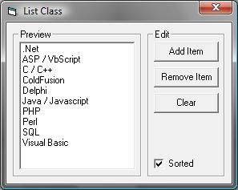



## List Class

### Description

This class is an alternative for the ListBox control.

The class allows you to have all the functions of a ListBox without the GUI overhead. This is perfect if you are jsut wishing to manage data in the list and not actully show it to the user.

The class also contains a modified Quick Sort function allowing you to sort the list without messing up what item data goes with each item.
 
### More Info
 

             |
---                |---
**Submitted On**   |2008-01-14 16:30:02
**By**             |[Goofy Goblin](https://github.com/Planet-Source-Code/PSCIndex/blob/master/ByAuthor/goofy-goblin.md)
**Level**          |Intermediate
**User Rating**    |5.0 (10 globes from 2 users)
**Compatibility**  |VB 6\.0
**Category**       |[Miscellaneous](https://github.com/Planet-Source-Code/PSCIndex/blob/master/ByCategory/miscellaneous__1-1.md)
**World**          |[Visual Basic](https://github.com/Planet-Source-Code/PSCIndex/blob/master/ByWorld/visual-basic.md)
**Archive File**   |[List\_Class2097321142008\.zip](https://github.com/Planet-Source-Code/goofy-goblin-list-class__1-69918/archive/master.zip)

